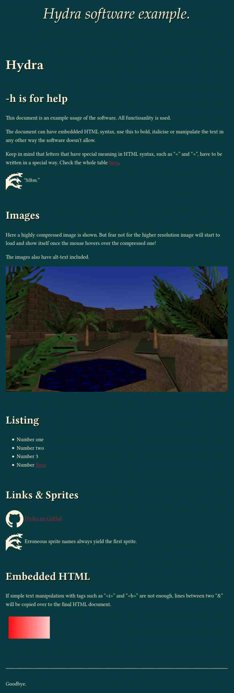

# Hydra

Write out HTML from textual files.

## Syntax

By default, the syntax is reminiscent of Markdown.

Link example- `|github.com|GitHub is here!|`

Image example- ``

Fancy text- `~This whole line uses special CSS defined in "configuration.h".`

Sprite- `~{CSSclass} additional text next to the sprite.`

Horizontal rule- `---`

Unordered list example-

```
 %
 Milk
 Egg
 Flour
 %
```

Raw HTML-

```
 &
 <!-- All this content will be copied to the output document. -->
 <script>console.log("Hei!");</script>
 &
```

### Images

All images **must** be on a separate line.

### Sprites (inline images)

A paragraph can being with an image from a sprite sheet.
Use `${sprite}` notation to specify what sprite to draw.
Sprites are defined in the CSS.

Example: `#wyvern{background-position: -128px 0}`.

### Special text (fancy text)

For the header text you may want to use a different font, colour or whatnot.

Paragraph beginning with `~` is considered to be fancy. The text will use special styling defined with the CSS class `f`.

Example:

.md:

```
~Whoa i'm huge!
```

configuration.h:

```
#define STYLE …
.f{font-size:4.0em; text-align:center}\
…
```

## Example documents or templates

The example documents can be found in `example` directory.


