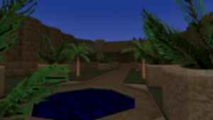

TITLE: Hydra
JAVASCRIPT: res/main.js
KEYWORDS: Hydra,Software
DESCRIPTION: Hydra software example.
# Hydra
£{Author - Aleksandar Urosevic}

## -h is for help

The whole point of life is to automate its process, right? No, yes?
How about a copy/pasted text to offset my writing? No, no.

¬{basilisk}mhm.

Cog, cog... and factoreo?

## Images

¬{sand}S.A.N.D.
A bunch of text to show how cute this schema is. It's dark, yes, but it also looks really cozy.

This is sand.

Goodbye.

